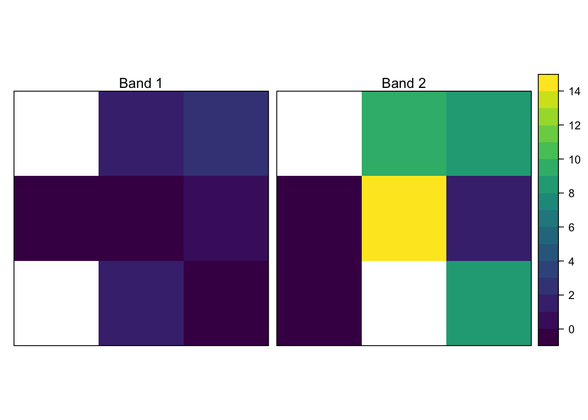
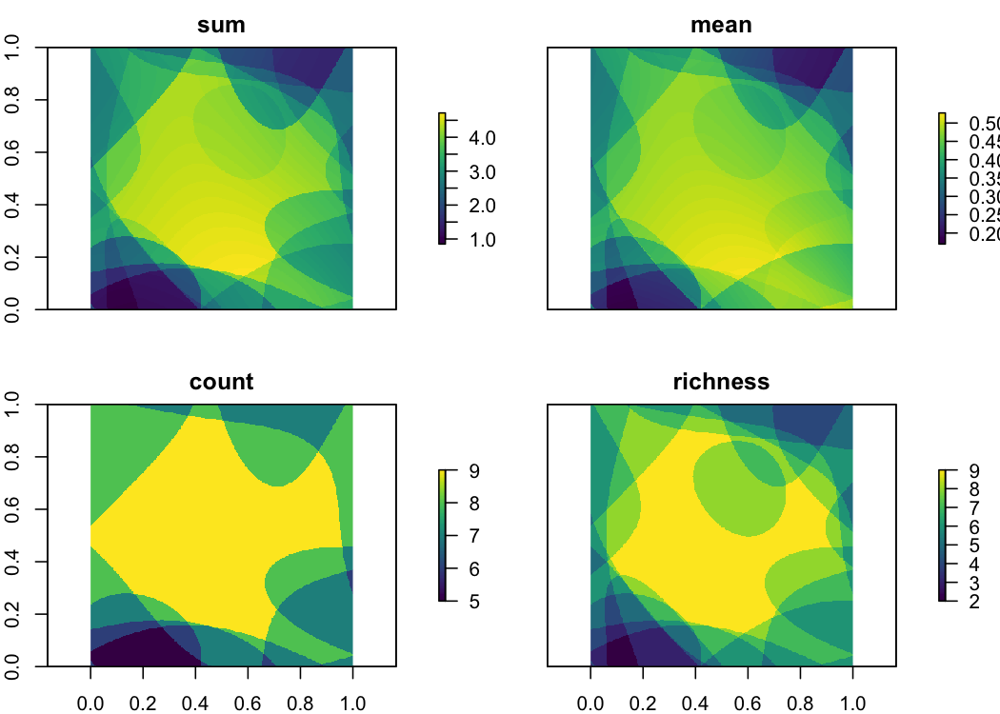
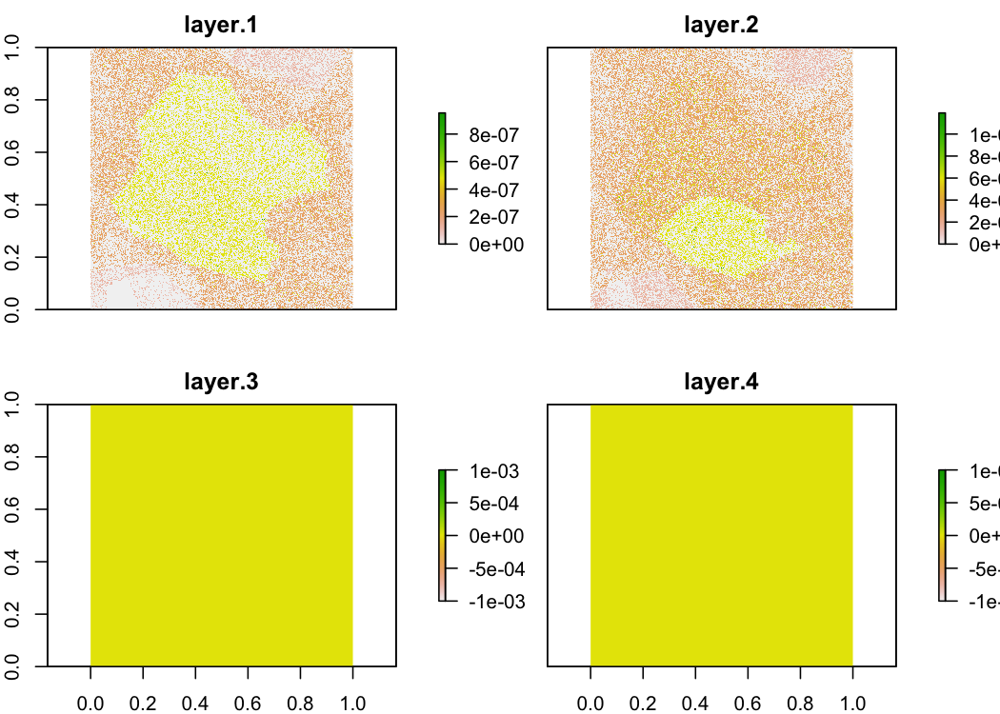

Raster Summarization
================

Comparing R `raster` and `gdal-summarize.py`, which uses Python with
GDAL bindings, for aggregating raster data across layers.

## Testing accuracy

To make sure `gdal-summarize.py` is doing what we think it’s doing,
let’s apply it to the GeoTIFF `data/small1.tif`. This tiny file stores
two raster bands with dimensions 3x3 and the cells contains positive
integers, zeros, and missing values. We’ll compare the results of
`gdal-summarize.py` and the equivalent using the `raster` R package.

``` r
library(raster)
library(rasterVis)
library(viridis)
library(ebirdst)
library(tidyverse)

r <- stack("data/small1.tif")
as.matrix(r[[1]])
#>      [,1] [,2] [,3]
#> [1,]   NA    2    3
#> [2,]    0    0    1
#> [3,]   NA    2    0
levelplot(r, 
          col.regions = viridis::viridis,
          xlab = NULL, ylab = NULL, 
          scales = list(draw = FALSE),
          names.attr = c("Band 1", "Band 2"))
```



Let’s start by summarizing these data in Python using
`gdal-summarize.py` with the four different summary functions: sum,
mean, count, and richness. We’ll summarize across all (2) bands.

``` r
# prepare the commands
funs <- c("sum", "mean", "count", "richness")
cmd <- str_glue("./gdal-summarize.py data/small1.tif -w -q ",
                "-f {funs} -o output/small1_{funs}.tif")
# run the commands
walk(cmd, ~ {print(.); system(paste("source ~/.bash_profile;", .))})
#> ./gdal-summarize.py data/small1.tif -w -q -f sum -o output/small1_sum.tif
#> ./gdal-summarize.py data/small1.tif -w -q -f mean -o output/small1_mean.tif
#> ./gdal-summarize.py data/small1.tif -w -q -f count -o output/small1_count.tif
#> ./gdal-summarize.py data/small1.tif -w -q -f richness -o output/small1_richness.tif
# read in the files
s_python <- str_glue("output/small1_{funs}.tif") %>% 
  stack() %>% 
  setNames(funs)
```

Now let’s do the same thing in R using `raster`.

``` r
r_sum <- calc(r, sum, na.rm = TRUE)
r_mean <- calc(r, mean, na.rm = TRUE)
r_count <- calc(r >= 0, sum, na.rm = TRUE)
r_richness <- calc(r > 0, sum, na.rm = TRUE)
# stack the raster results
s_raster <- stack(r_sum, r_mean, r_count, r_richness) %>% 
  setNames(c("sum", "mean", "count", "richness"))
```

Now we can compare the results. For example, the results for the mean of
the layers look identical. Noticing that the zero, non-zero, and missing
values are all matching.

``` r
print("Python sum: ")
#> [1] "Python sum: "
as.matrix(s_python[["mean"]])
#>      [,1] [,2] [,3]
#> [1,]   NA  5.5  5.5
#> [2,]    0  7.0  1.5
#> [3,]    0  2.0  4.0
print("R sum:")
#> [1] "R sum:"
as.matrix(s_raster[["mean"]])
#>      [,1] [,2] [,3]
#> [1,]  NaN  5.5  5.5
#> [2,]    0  7.0  1.5
#> [3,]    0  2.0  4.0
```

Let’s compare across all four summary functions using `compareRaster()`,
which checks whether two `Raster` objects are identical in extent,
dimensions, projection, resolution, and values.

``` r
for (f in funs) {
  comp <- compareRaster(s_python[[f]], s_raster[[f]], 
                        res = TRUE, values = TRUE,
                        stopiffalse = FALSE)
  print(str_glue("{f} rasters identical: {ifelse(comp, 'Yes', 'No')}"))
}
#> sum rasters identical: Yes
#> mean rasters identical: Yes
#> count rasters identical: Yes
#> richness rasters identical: Yes
```

### Alternate usage

`gdal-summarize.py` can be used in a variety of other ways. Here we test
to make sure a couple of the other ways of using it work as expected.

  - Summarize the first band across a set of raster files

<!-- end list -->

``` r
# raster
r1 <- stack("data/small1.tif")
r2 <- stack("data/small2.tif")
r12 <- stack(r1[[1]], r2[[1]]) %>% 
  calc(fun = mean, na.rm = TRUE)

# python
f_tmp <- "output/small_temp.tif"
str_glue("source ~/.bash_profile;",
         "./gdal-summarize.py data/small1.tif data/small2.tif -w -q ",
         "-f mean -o {f_tmp}") %>% 
  {print(.); system(.)}
#> source ~/.bash_profile;./gdal-summarize.py data/small1.tif data/small2.tif -w -q -f mean -o output/small_temp.tif
p12 <- raster(f_tmp)
tibble(raster = r12[], python = p12[])
#> # A tibble: 9 x 2
#>   raster python
#>    <dbl>  <dbl>
#> 1    2      2  
#> 2    1      1  
#> 3    1.5    1.5
#> 4    0.5    0.5
#> 5    0.5    0.5
#> 6    0.5    0.5
#> 7  NaN     NA  
#> 8    2      2  
#> 9    0.5    0.5
```

  - Summarize a defined band across a set of raster files

<!-- end list -->

``` r
# raster
r12 <- stack(r1[[2]], r2[[2]]) %>% 
  calc(fun = mean, na.rm = TRUE)

# python
str_glue("source ~/.bash_profile;",
         "./gdal-summarize.py data/small1.tif data/small2.tif -w -q ",
         "-b 2 -f mean -o {f_tmp}") %>% 
  {print(.); system(.)}
#> source ~/.bash_profile;./gdal-summarize.py data/small1.tif data/small2.tif -w -q -b 2 -f mean -o output/small_temp.tif
p12 <- raster(f_tmp)
tibble(raster = r12[], python = p12[])
#> # A tibble: 9 x 2
#>   raster python
#>    <dbl>  <dbl>
#> 1  NaN     NA  
#> 2    8.5    8.5
#> 3    8.5    8.5
#> 4    6.5    6.5
#> 5   12.5   12.5
#> 6    1      1  
#> 7    0      0  
#> 8    0      0  
#> 9    8.5    8.5
```

  - Summarize different bands across each raster file, band 1 for the
    first file and band 2 for the second

<!-- end list -->

``` r
# raster
r12 <- stack(r1[[1]], r2[[2]]) %>% 
  calc(fun = mean, na.rm = TRUE)

# python
str_glue("source ~/.bash_profile;",
         "./gdal-summarize.py data/small1.tif data/small2.tif -w -q ",
         "-b 1 2 -f mean -o {f_tmp}") %>% 
  {print(.); system(.)}
#> source ~/.bash_profile;./gdal-summarize.py data/small1.tif data/small2.tif -w -q -b 1 2 -f mean -o output/small_temp.tif
p12 <- raster(f_tmp)
tibble(raster = r12[], python = p12[])
#> # A tibble: 9 x 2
#>   raster python
#>    <dbl>  <dbl>
#> 1  NaN     NA  
#> 2    5      5  
#> 3    6      6  
#> 4    6.5    6.5
#> 5    5.5    5.5
#> 6    0.5    0.5
#> 7  NaN     NA  
#> 8    1      1  
#> 9    4.5    4.5
```

## Efficiency

Now that we’ve confirmed everything is working, let’s use one of the
larger example datasets to compare the efficiency of these approaches.
This file stores 9 raster bands with dimensions 250x250 and the cells
contains positive integers, zeros, and missing values. We’ll compare the
processing speed of `gdal-summarize.py` and the equivalent using the
`raster` R package.

``` r
# prepare the commands
funs <- c("sum", "mean", "count", "richness")
cmd <- str_glue("source ~/.bash_profile;",
                "./gdal-summarize.py data/large1.tif -w -q ",
                "-f {funs} -o output/large1_{funs}.tif")
# run the commands
p_results <- tibble(fun = funs, cmd = cmd) %>% 
  mutate(time_python = map_dbl(cmd, ~ system.time(system(.))[3])) %>% 
  select(-cmd)
p_stack <- str_glue("output/large1_{p_results$fun}.tif") %>% 
  stack() %>% 
  setNames(p_results$fun) %>% 
  setMinMax()
plot(p_stack, col = viridis(100))
```



Now let’s do the same thing in R using `raster`.

``` r
r <- stack("data/large1.tif") %>% readAll()
t_sum <- system.time({r_sum <- calc(r, sum, na.rm = TRUE)})[3]
t_mean <- system.time({r_mean <- calc(r, mean, na.rm = TRUE)})[3]
t_count <- system.time({r_count <- calc(r >= 0, sum, na.rm = TRUE)})[3]
t_richness <- system.time({r_richness <- calc(r > 0, sum, na.rm = TRUE)})[3]
# stack the raster results
r_results <- tibble(fun = c("sum", "mean", "count", "richness"), 
                    time_raster = c(t_sum, t_mean, t_count, t_richness))
r_stack <- stack(r_sum, r_mean, r_count, r_richness) %>% 
  setNames(c("sum", "mean", "count", "richness"))
plot(r_stack, col = viridis(100))
```


The results look quite similar, but let’s take the difference between
the Python and R versions to check.

``` r
difference <- abs(r_stack - p_stack)
cellStats(difference, max)
#> [1] 9.536743e-07 1.192093e-07 0.000000e+00 0.000000e+00
cellStats(difference, mean)
#>      layer.1      layer.2      layer.3      layer.4 
#> 1.125953e-07 1.582624e-08 0.000000e+00 0.000000e+00
plot(difference)
```



The count and richness summaries are identical, while the sum and mean
summaries have small differences in the 7th decimal place, likely the
result of floating point math. Finally, let’s look at the difference in
run times between the methods.

``` r
inner_join(p_results, r_results, by = "fun")
#> # A tibble: 4 x 3
#>   fun      time_python time_raster
#>   <chr>          <dbl>       <dbl>
#> 1 sum             3.75       0.618
#> 2 mean            3.76       0.344
#> 3 count           3.72       0.828
#> 4 richness        3.74       0.528
```

# eBird Status & Trends

Finally, applying this to some real data from eBird Status & Trends.
First, summarizing with Python.

``` r
f_abd <- "data/woothr.tif"
abd <- stack(f_abd)

# python
funs <- c("sum", "mean", "count", "richness")
cmd <- str_glue("source ~/.bash_profile;",
                "./gdal-summarize.py {f_abd} -w -q ",
                "-f {funs} -o output/woothr_{funs}.tif")
# run the commands
p_results <- tibble(fun = funs, cmd = cmd) %>% 
  mutate(time_python = map_dbl(cmd, ~ system.time(system(.))[3])) %>% 
  select(-cmd)
p_stack <- str_glue("output/woothr_{p_results$fun}.tif") %>% 
  stack() %>% 
  setNames(p_results$fun) %>% 
  setMinMax()
```

And now with the `raster` R package.

``` r
t_sum <- system.time({r_sum <- calc(abd, sum, na.rm = TRUE)})[3]
t_mean <- system.time({r_mean <- calc(abd, mean, na.rm = TRUE)})[3]
t_count <- system.time({r_count <- calc(abd >= 0, sum, na.rm = TRUE)})[3]
t_richness <- system.time({r_richness <- calc(abd > 0, sum, na.rm = TRUE)})[3]
# stack the raster results
r_results <- tibble(fun = c("sum", "mean", "count", "richness"), 
                    time_raster = c(t_sum, t_mean, t_count, t_richness))
r_stack <- stack(r_sum, r_mean, r_count, r_richness) %>% 
  setNames(c("sum", "mean", "count", "richness"))
```

Comparing the results.

``` r
inner_join(p_results, r_results, by = "fun")
```

    #> # A tibble: 4 x 3
    #>   fun      time_python time_raster
    #>   <chr>          <dbl>       <dbl>
    #> 1 sum             74.2        116.
    #> 2 mean            76.0        120.
    #> 3 count           73.8        378.
    #> 4 richness        72.9        380.
